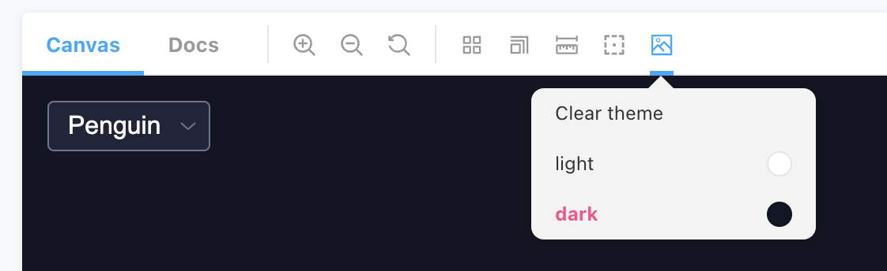

# @component-ui/react

## A UI components library made in React

> **Note on my approach**: As the goal was to create a **reusble** select component, I chose do it the scalable way. That means this repository not only can be used to build a Select but other essential components too. It has a workflow for previewing, publishing, testing and development. So because of this this project might seem an overkill for this assignment. But I tried to show off some of my skills and experience from building consistent, accessible, reusable and robust UI component libraries and interfaces.

## Tech Stack
- [React.js](https://reactjs.org/)
- [Stitches](https://stitches.dev/) - Main styling library

## Theming

There're two themes that you can use. Light and Dark. By default, the Light theme is active. The Dark theme is exported from the core package.

[Learn more](https://stitches.dev/docs/theming) about how you can programmatically use themes in Stitches.

To see a theme in action go to Storybook and change the theme as shown below: 




## Chromatic preview

To make it convinient for reviewers, we deploy the branch to chromatic and put the link to the preview storybook in the pr thread. See [the example PR](https://github.com/deebov/component-ui-react/pull/1).

## Install

Install via yarn or npm:

```bash
yarn add @component-ui/react
```

## Usage

```jsx
import { AtlasSelect } from '@component-ui/react'

<AtlasSelect options={[...]} />
```

## Run

Start storybook

```bash
yarn start
```

Bundle with watch mode (useful when the package is linked)

```bash
yarn dev
```

## Publish

We use [release-it](https://github.com/release-it/release-it) to manage versioning and publishing.
Before publishing make sure that `GITHUB_TOKEN` environment variable is avaiable and contains your GitHub personal token. This is needed for GitHub releases.

Then run:

```bash
yarn release
```

## Commit format

Using [angular](https://github.com/angular/angular/blob/master/CONTRIBUTING.md#commit) conventional-commits is highly recommended.

### Commit Message Header

```
<type>(<scope>): <short summary>
  │       │             │
  │       │             └─⫸ Summary in present tense. Not capitalized. No period at the end.
  │       │
  │       └─⫸ Commit Scope
  │
  └─⫸ Commit Type: build|ci|docs|feat|fix|perf|refactor|test
```

The `<type>` and `<summary>` fields are mandatory, the `(<scope>)` field is optional.

### Type

Must be one of the following:

- **build**: Changes that affect the build system or external dependencies (example scopes: gulp, broccoli, npm)
- **ci**: Changes to our CI configuration files and scripts (example scopes: Circle, BrowserStack, SauceLabs)
- **docs**: Documentation only changes
- **feat**: A new feature
- **fix**: A bug fix
- **perf**: A code change that improves performance
- **refactor**: A code change that neither fixes a bug nor adds a feature
- **test**: Adding missing tests or correcting existing tests

### Scope

The scope should be the name of the package affected (as perceived by the person reading the changelog generated from commit messages).

## Folder structure and naming guidelines

```
atlas-ui
│   README.md
│
└──packages
    │
    └──component-name
        │
        └──ComponentName.tsx          // Contains the main logic
        └──ComponentName.styled.tsx   // Contains the styled components
        └──ComponentName.stories.tsx  // Contains Storybook stories
        └──ComponentName.test.tsx     // Contains all the test cases for this Component
        └──ComponentName.util.tsx     // Contains helper functions
        └──ComponentName.types.tsx    // Contains Typescript Interface and Types
        └──index.ts                   // Exports all public APIs and components

```
